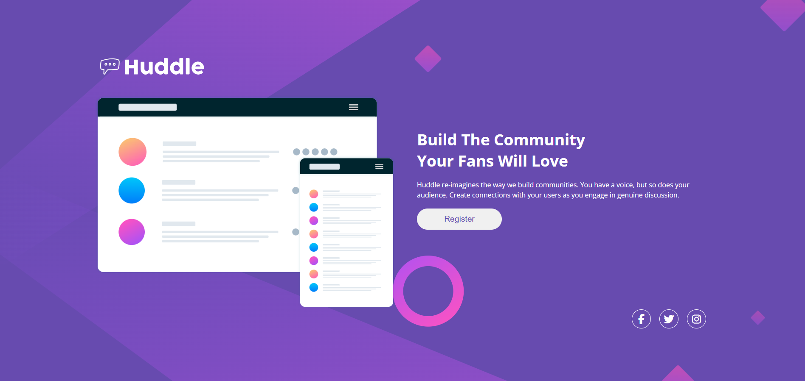

# Projeto de Landing Page

Um projeto de landing page moderno e responsivo, destacando habilidades de desenvolvimento front-end usando apenas HTML e CSS, com foco em tecnicas de flex.

## Visão Geral do Projeto
Este projeto é uma landing page limpa e responsiva, projetada para demonstrar habilidades de front-end. O objetivo é criar sites visualmente atraentes usando tecnologias mínimas, porém eficazes.

## Funcionalidades
- ✅ Design totalmente responsivo.
- 🚀 Interface limpa e moderna.
- 🌐 Compatibilidade entre navegadores.

## Tecnologias Utilizadas
- 📄 **HTML5**
- 🎨 **CSS3**

## Uso
Basta abrir o arquivo `index.html` em um navegador web para visualizar a landing page. Nenhuma configuração adicional é necessária.

---

## Preview da Página Inicial

# Contato

